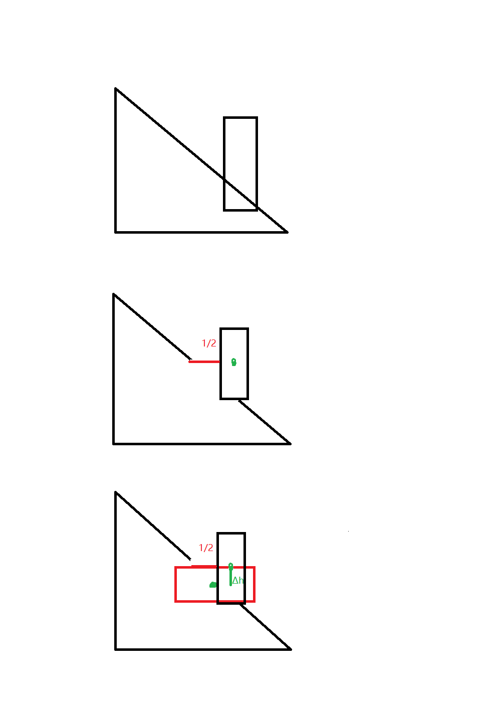

起因是我前几天收拾初中的语文书，忽然翻到纪晓岚的《河中石兽》，~~竟然把我给看笑了~~，竟然让我有所深思，来和大家分享一下。

 

纪晓岚大家想必十分熟悉，《铁齿铜牙纪晓岚》是真的经典，相信这个人写的《河中石兽》大家也没有忘记。

忘了的可以看看：

***

“沧州南一寺临河干，山门圮于河，二石兽并沉焉。阅十余岁，僧募金重修，求二石兽于水中，竟不可得，以为顺流下矣。棹数小舟，曳铁钯，寻十余里无迹。

　　一讲学家设帐寺中，闻之笑曰：“尔辈不能究物理。是非木杮，岂能为暴涨携之去？乃石性坚重，沙性松浮，湮于沙上，渐沉渐深耳。沿河求之，不亦颠乎？”众服为确论。

　　一老河兵闻之，又笑曰：“凡河中失石，当求之于上流。盖石性坚重，沙性松浮，水不能冲石，其反激之力，必于石下迎水处啮沙为坎穴，渐激渐深，至石之半，石必倒掷坎穴中。如是再啮，石又再转。转转不已，遂反溯流逆上矣。求之下流，固颠；求之地中，不更颠乎？”如其言，果得于数里外。然则天下之事，但知其一，不知其二者多矣，可据理臆断欤？"

***

 

**这里面最反常识的自然是“凡河中失石，当求之于上流”最后还真的“如其言，果得于数里外”了。最后，纪晓岚教育我们不能据理臆断，多好的用意啊。**

 

**BUT，**不知道你是否觉得奇怪。我记得当时在学习这篇课文时，就深深地感到了疑惑，但由于没有什么知识储备，也说不出到底是哪里有问题。

不过现在，在拥有了更多的物理知识后，我现在终于可以用知识证明纪晓岚的论述果然有问题。

 

**首先**，既然是河，而且在河北沧州南部的河，不太可能是靠风吹着流的，在河流形成之初，水一定会往低处流，找最低的路线走。那么，河的上游和下游就一定是有高度差的。

**其次**，是谁给了石兽能量让他能够逆流而上呢？这个力一定不是水，水向下流，与石兽的运动方向相反，做负功。那能量的来源是哪里呢？我们来看文章是如何说的。

“水不能冲石，其反激之力，必于石下迎水处啮沙为坎穴，渐激渐深，至石之半，石必倒掷坎穴中。”

ahhhh，这是让石头向下倒，倒在坑中，利用了重力势能。我们无论以哪个面为基准面，重力势能要做功，重心必然降低，石兽倒的次数越多，重心就越低。文中说“至石之半”，那么我们可以近似认为，每次石兽的重心都降低了一半，虽然一半复一半，一半何其多，但到后面，这个重力做的功就不足以抵消水所做的负功了。石兽就不会再转了。

看我的灵魂画手。。。

**最后**，这篇文章老河兵所说的到“如是再啮，石又再转。”都是可能发生的，只要重力势能做的功足够多能抵消水的负功就可以。但后面的“转转不已，遂反溯流逆上矣。”就是纯粹的胡诌了，要转数里外不知这石头的质量有多大，高度有多高呢。

分析下来，整篇文章的真实性十分可疑，某度上说纪晓岚的这些故事是从民间搜集来的，这。。。

纪晓岚希望通过这个故事教育我们不要“据理臆断”，这篇文章的实际教育效果非常好，纪同志亲身实践了“据理臆断”，实在是讽刺！

 

 

**你以为这就完了，不不不，在嘲讽了纪晓岚之后我们也要思考思考我们该怎么办**

看完了纪晓岚的事件，我不得不陷入了沉思，今天的我们是不是也在据理臆断呢？

在文中，理是事物的道理，这与我们今天物理学科所研究的东西是一致的。（化学其实也可以算是物理电磁学的一个分支）我们在使用物理知识的时候是否就在据理臆断呢？

讲学家通过对沙子和石头规律的了解，推断出石头应该沉在地中是据理臆断。那么我们根据机械能守恒定律推断出石头不可能一直向上游运动是否也是据理臆断呢？

**按照作者这样的定义，我发现在现代社会我们几乎每个人都在据理臆断。**

 

你所用的物理知识，很多你是无法亲身用实验去验证的，尤其是出了牛顿牛大爷管辖的范围外。再比如说化学里的微观结构，我可能一辈子都看不到电子是如何成键的，我只能从宏观上看到现象，验证它的过程，太复杂了。

现代社会中还有很多这样你只能看到现象却无法弄清楚原理的东西，比如你手边的手机，电脑，甚至简单到你手边的一本书，不在印刷行业工作又有谁了解印刷机是如何把字印到纸上的？

 

更进一步说，人类正是有了据理臆断，才能形成知识的积累。我们通过书籍、教学等方式，把上一代人的知识传递到下一代去，而下一代又在这个知识体系中添砖加瓦，最终才形成了现代科学复杂到一个人不可能完全掌握的知识体系。**如果没有这种据理臆断，人类的科学就会止步不前，人类也只能依靠一个人的灵感和创意实现极为缓慢的发展。所以说，这种据理臆断并不应该摒弃而更应该发扬光大。**

**所以说，在现代社会这个复杂的分工体系中，据理臆断是一种常态，更是一种必须。**

 

好了，欢迎讨论。

